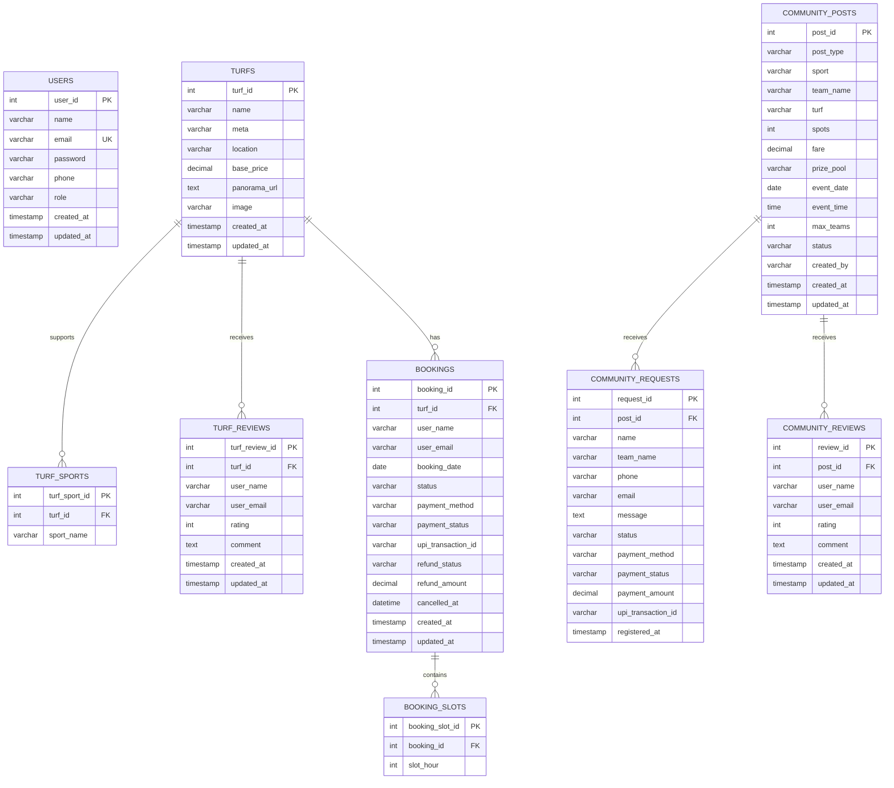
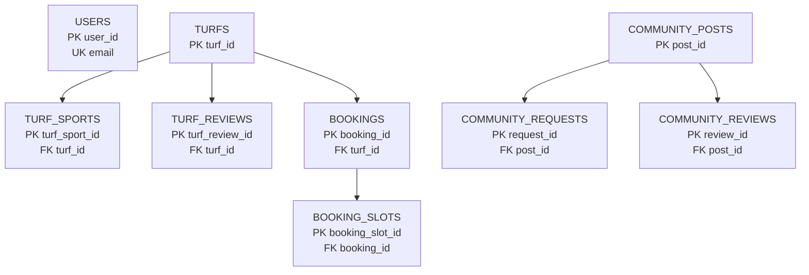

# TurfArena Database Design

## 1. Problem Statement

TurfArena is an online turf booking and community sports management system. The system allows users to register, log in, browse available turfs, view supported sports, book one or more hourly slots for a selected date, make payments, and cancel bookings with refund handling. In addition to booking, the platform supports user reviews for turfs, community posts for solo/team/tournament activities, participant requests, and review feedback on community events.

The database must store user details, turf details, supported sports, bookings, booked slot hours, payment and refund status, community activity posts, participant requests, and review data. The design should avoid redundancy, preserve data integrity, support one-to-many and many-to-many style relationships through associative tables, and make it easy for both users and administrators to manage turf operations.

## 2. Objectives of the Database Design

- Maintain secure and structured records of users and administrators.
- Store complete turf information with location, price, image, and panorama details.
- Support multi-slot booking for a turf on a given date.
- Track booking payment and refund details.
- Allow users to rate and review turfs.
- Support community engagement through solo, team, and tournament posts.
- Record requests made against community posts.
- Allow reviews for community posts.
- Enforce referential integrity using primary keys, foreign keys, uniqueness, and check constraints.

## 3. Modules of the System

### 3.1 User Management Module
- User registration
- User login
- Role handling (`user`, `admin`)
- User profile details such as name, email, and phone

### 3.2 Turf Management Module
- Add and manage turfs
- Store turf metadata, location, pricing, and media
- Maintain the list of sports supported by each turf

### 3.3 Booking Management Module
- Create turf bookings
- Associate one booking with multiple hourly slots
- Prevent duplicate slot allocation through unique constraints
- Manage booking status

### 3.4 Payment and Refund Module
- Store payment method and payment status
- Save transaction reference
- Track cancellation and refund eligibility
- Record refund amount and refund status

### 3.5 Turf Review Module
- Allow one review per user per turf
- Store rating and comment
- Support rating analysis and review history

### 3.6 Community Engagement Module
- Create solo/team/tournament posts
- Store event date, time, fare, prize pool, and status
- Track who created the post

### 3.7 Community Request Module
- Allow users to join or respond to community posts
- Store participant/team details and request status
- Track payment data for community participation

### 3.8 Community Review Module
- Store ratings and comments for community posts
- Allow one review per user per post

## 4. Main Entities

- `Users`
- `Turfs`
- `Turf_Sports`
- `Bookings`
- `Booking_Slots`
- `Turf_Reviews`
- `Community_Posts`
- `Community_Requests`
- `Community_Reviews`

## 5. ER Diagram



## 6. ER to Relational Mapping

### 6.1 USERS
`USERS(user_id, name, email, password, phone, role, created_at, updated_at)`

- Primary Key: `user_id`
- Unique Key: `email`

### 6.2 TURFS
`TURFS(turf_id, name, meta, location, base_price, panorama_url, image, created_at, updated_at)`

- Primary Key: `turf_id`

### 6.3 TURF_SPORTS
`TURF_SPORTS(turf_sport_id, turf_id, sport_name)`

- Primary Key: `turf_sport_id`
- Foreign Key: `turf_id -> TURFS(turf_id)`
- Unique Key: `(turf_id, sport_name)`

### 6.4 TURF_REVIEWS
`TURF_REVIEWS(turf_review_id, turf_id, user_name, user_email, rating, comment, created_at, updated_at)`

- Primary Key: `turf_review_id`
- Foreign Key: `turf_id -> TURFS(turf_id)`
- Unique Key: `(turf_id, user_email)`

### 6.5 BOOKINGS
`BOOKINGS(booking_id, turf_id, user_name, user_email, booking_date, status, payment_method, payment_status, upi_transaction_id, refund_status, refund_amount, cancelled_at, created_at, updated_at)`

- Primary Key: `booking_id`
- Foreign Key: `turf_id -> TURFS(turf_id)`

### 6.6 BOOKING_SLOTS
`BOOKING_SLOTS(booking_slot_id, booking_id, slot_hour)`

- Primary Key: `booking_slot_id`
- Foreign Key: `booking_id -> BOOKINGS(booking_id)`
- Unique Key: `(booking_id, slot_hour)`

### 6.7 COMMUNITY_POSTS
`COMMUNITY_POSTS(post_id, post_type, sport, team_name, turf, spots, fare, prize_pool, event_date, event_time, max_teams, status, created_by, created_at, updated_at)`

- Primary Key: `post_id`

### 6.8 COMMUNITY_REQUESTS
`COMMUNITY_REQUESTS(request_id, post_id, name, team_name, phone, email, message, status, payment_method, payment_status, payment_amount, upi_transaction_id, registered_at)`

- Primary Key: `request_id`
- Foreign Key: `post_id -> COMMUNITY_POSTS(post_id)`
- Unique Key: `(post_id, email)`

### 6.9 COMMUNITY_REVIEWS
`COMMUNITY_REVIEWS(review_id, post_id, user_name, user_email, rating, comment, created_at, updated_at)`

- Primary Key: `review_id`
- Foreign Key: `post_id -> COMMUNITY_POSTS(post_id)`
- Unique Key: `(post_id, user_email)`

## 7. Relational Schema

```text
USERS(
  user_id PK,
  name,
  email UK,
  password,
  phone,
  role,
  created_at,
  updated_at
)

TURFS(
  turf_id PK,
  name,
  meta,
  location,
  base_price,
  panorama_url,
  image,
  created_at,
  updated_at
)

TURF_SPORTS(
  turf_sport_id PK,
  turf_id FK -> TURFS.turf_id,
  sport_name,
  UNIQUE(turf_id, sport_name)
)

TURF_REVIEWS(
  turf_review_id PK,
  turf_id FK -> TURFS.turf_id,
  user_name,
  user_email,
  rating,
  comment,
  created_at,
  updated_at,
  UNIQUE(turf_id, user_email)
)

BOOKINGS(
  booking_id PK,
  turf_id FK -> TURFS.turf_id,
  user_name,
  user_email,
  booking_date,
  status,
  payment_method,
  payment_status,
  upi_transaction_id,
  refund_status,
  refund_amount,
  cancelled_at,
  created_at,
  updated_at
)

BOOKING_SLOTS(
  booking_slot_id PK,
  booking_id FK -> BOOKINGS.booking_id,
  slot_hour,
  UNIQUE(booking_id, slot_hour)
)

COMMUNITY_POSTS(
  post_id PK,
  post_type,
  sport,
  team_name,
  turf,
  spots,
  fare,
  prize_pool,
  event_date,
  event_time,
  max_teams,
  status,
  created_by,
  created_at,
  updated_at
)

COMMUNITY_REQUESTS(
  request_id PK,
  post_id FK -> COMMUNITY_POSTS.post_id,
  name,
  team_name,
  phone,
  email,
  message,
  status,
  payment_method,
  payment_status,
  payment_amount,
  upi_transaction_id,
  registered_at,
  UNIQUE(post_id, email)
)

COMMUNITY_REVIEWS(
  review_id PK,
  post_id FK -> COMMUNITY_POSTS.post_id,
  user_name,
  user_email,
  rating,
  comment,
  created_at,
  updated_at,
  UNIQUE(post_id, user_email)
)
```

## 8. Schema Diagram



## 9. Important Constraints Used

- `email` in `USERS` is unique.
- `role` in `USERS` is restricted to `user` or `admin`.
- `rating` in review tables is restricted to `1` to `5`.
- `status`, `payment_status`, and `refund_status` in `BOOKINGS` are controlled by check constraints.
- `post_type` in `COMMUNITY_POSTS` is restricted to `solo`, `team`, or `tournament`.
- `status` and `payment_status` in `COMMUNITY_REQUESTS` are also controlled by check constraints.
- `slot_hour` in `BOOKING_SLOTS` is restricted from `0` to `23`.
- Composite unique keys prevent duplicate sports, reviews, and requests.

## 10. Normalization Note

The schema is largely normalized up to Third Normal Form (3NF):

- User data is stored separately from turf data.
- Multi-valued sports for a turf are separated into `TURF_SPORTS`.
- Multi-slot booking details are separated into `BOOKING_SLOTS`.
- Review and request data are stored in separate relation tables.
- Repeating groups and many-valued attributes are removed from base entity tables.

## 11. Conclusion

This database design supports the complete TurfArena workflow: user authentication, turf discovery, booking and payment handling, review management, and community sports coordination. The schema is practical, normalized, and directly mappable to the SQL implementation used by the application.
